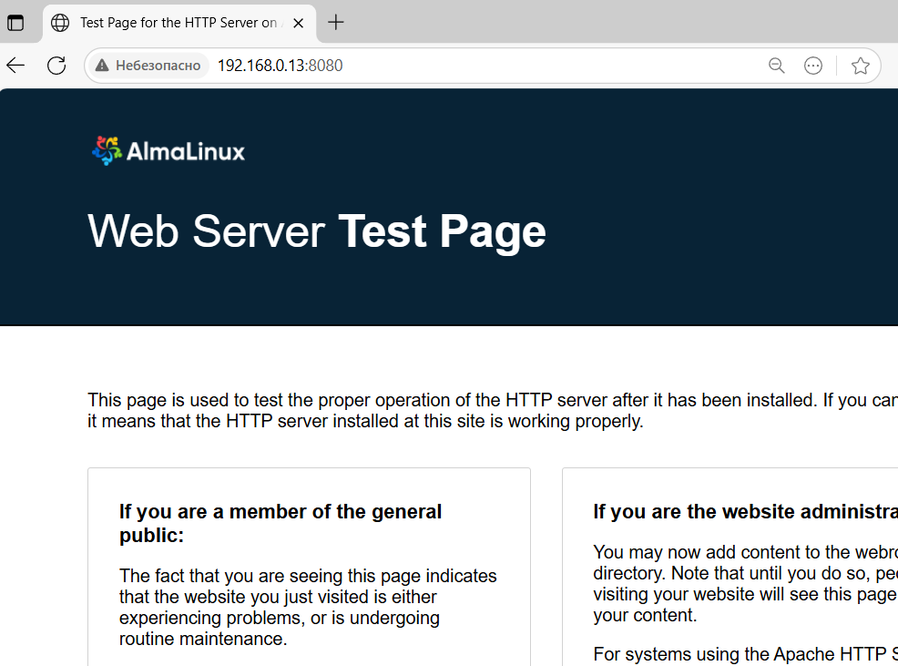

## ДЗ-16 Плэйбук для установки NGINX
#### Задачи
+ На сервере используя Ansible необходимо развернуть nginx со следующими условиями:
+ необходимо использовать модуль yum/apt;
+ конфигурационные файлы должны быть взяты из шаблона jinja2 с перемененными;
+ после установки nginx должен быть в режиме enabled в systemd;
+ должен быть использован notify для старта nginx после установки;
+ сайт должен слушать на нестандартном порту - 8080, для этого использовать переменные в Ansible.

Для установки NGINX подготовлен плэйбук playbook_nginx.yml и вспомогательный   
+ Содержание каталога:
```
[nn@a9-ansible ansible]$ tree
.
├── ansible.cfg				# Конфигурационный файл проекта
├── group_vars				# Каталог файлов переменных
│   ├── debian_machines
│   ├── redhat_machines
│   └── windows_machines
├── hosts.txt				# Inventory file
├── playbook1_ping.yml		# Вспомогательный для проверки связности
├── playbook_nginx.yml		# Плэйбук установки NGINX
└── templates				# Каталог шаблонов
    └── nginx.conf.j2

```

1. Проверяем доступность машин - все доступны
```
[nn@a9-ansible ansible]$ ansible-playbook playbook1_ping.yml -K
BECOME password:

PLAY [Test Connection to my servers] *************************************************************************************************************************

TASK [Gathering Facts] ***************************************************************************************************************************************
ok: [u16srv10]
ok: [a96srv1]
ok: [a96srv2]
ok: [u24srv10]

TASK [Ping servers] ******************************************************************************************************************************************
ok: [u16srv10]
ok: [u24srv10]
ok: [a96srv1]
ok: [a96srv2]

PLAY RECAP ***************************************************************************************************************************************************
a96srv1                    : ok=2    changed=0    unreachable=0    failed=0    skipped=0    rescued=0    ignored=0
a96srv2                    : ok=2    changed=0    unreachable=0    failed=0    skipped=0    rescued=0    ignored=0
u16srv10                   : ok=2    changed=0    unreachable=0    failed=0    skipped=0    rescued=0    ignored=0
u24srv10                   : ok=2    changed=0    unreachable=0    failed=0    skipped=0    rescued=0    ignored=0

[nn@a9-ansible ansible]$
```
Выполняем плэйбук установки NGINX на машины с RedHat-based OS
[Скриншот терминала](img/screen_ansible_output.PNG)
```
[nn@a9-ansible ansible]$ ansible-playbook playbook_nginx.yml -K
BECOME password:

PLAY [NGINX | Install and configure NGINX Web Server] ********************************************************************************************************

TASK [Gathering Facts] ***************************************************************************************************************************************
ok: [a96srv2]
ok: [a96srv1]

TASK [update cache] ******************************************************************************************************************************************
ok: [a96srv1]
ok: [a96srv2]

TASK [NGINX | Install Nginx Web Server] **********************************************************************************************************************
changed: [a96srv1]
changed: [a96srv2]

TASK [NGINX | Create NGINX config file from template] ********************************************************************************************************
changed: [a96srv2]
changed: [a96srv1]

RUNNING HANDLER [restart nginx] ******************************************************************************************************************************
changed: [a96srv2]
changed: [a96srv1]

RUNNING HANDLER [reload nginx] *******************************************************************************************************************************
changed: [a96srv1]
changed: [a96srv2]

PLAY RECAP ***************************************************************************************************************************************************
a96srv1                    : ok=6    changed=4    unreachable=0    failed=0    skipped=0    rescued=0    ignored=0
a96srv2                    : ok=6    changed=4    unreachable=0    failed=0    skipped=0    rescued=0    ignored=0

[nn@a9-ansible ansible]$
```
2. Проверяем работу NGINX
```
[nn@a9-ansible ansible]$ curl 192.168.0.13:8080
curl: (7) Failed to connect to 192.168.0.13 port 8080: Connection refused
```
Сервис недоступен, хотя в выводе ansible-playbook результаты ОК  
3. Просто добавляем task для открытия порта 8080 в фаерволле и запускаем плэйбук повторно:


```
[nn@a9-ansible ansible]$ nano playbook_nginx.yml
...
    - name: Разрешить порт 8080
      ansible.builtin.firewalld:
        port: 8080/tcp
        zone: public
        state: enabled
        permanent: true
```
Проверка:
```
[nn@a9-ansible ansible]$ ansible-playbook playbook_nginx.yml -K
BECOME password:

PLAY [NGINX | Install and configure NGINX Web Server] ********************************************************************************************************

...

TASK [Разрешить порт 8080] ***********************************************************************************************************************************
ok: [a96srv1]
ok: [a96srv2]

TASK [restart firewall] **************************************************************************************************************************************
changed: [a96srv2]
changed: [a96srv1]

PLAY RECAP ***************************************************************************************************************************************************
a96srv1                    : ok=6    changed=1    unreachable=0    failed=0    skipped=0    rescued=0    ignored=0
a96srv2                    : ok=6    changed=1    unreachable=0    failed=0    skipped=0    rescued=0    ignored=0

```
Повторно проверяем доступность:
```
[root@a9-ansible ~]# curl -v http://192.168.0.13:8080/404
*   Trying 192.168.0.13:8080...
* Connected to 192.168.0.13 (192.168.0.13) port 8080 (#0)
> GET /health HTTP/1.1
> Host: 192.168.0.13:8080
> User-Agent: curl/7.76.1
> Accept: */*
>
* Mark bundle as not supporting multiuse
< HTTP/1.1 404 Not Found
< Server: nginx/1.20.1
< Date: Mon, 25 Aug 2025 20:35:17 GMT
< Content-Type: text/html
< Content-Length: 153
< Connection: keep-alive
<
<html>
<head><title>404 Not Found</title></head>
<body>
<center><h1>404 Not Found</h1></center>
<hr><center>nginx/1.20.1</center>
</body>
</html>
* Connection #0 to host 192.168.0.13 left intact
[root@a9-ansible ~]#
```
Сервис доступен, можно открыть в обозревателе


## ДЗ-16 выполнено
